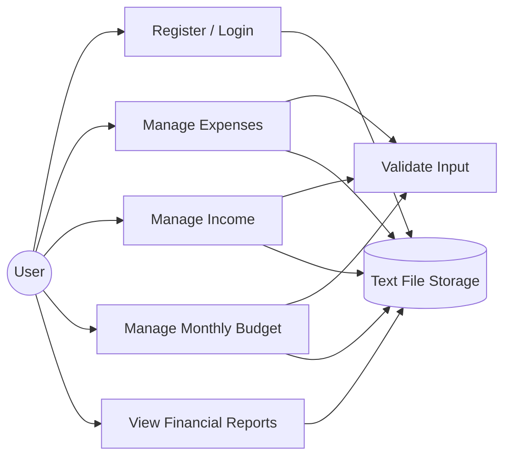
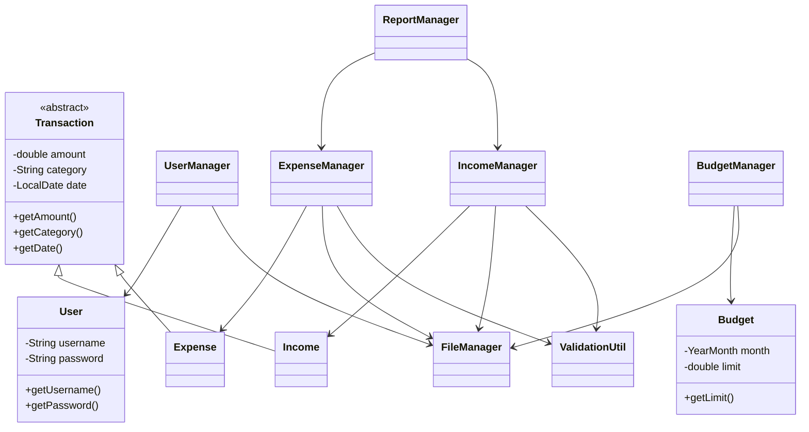
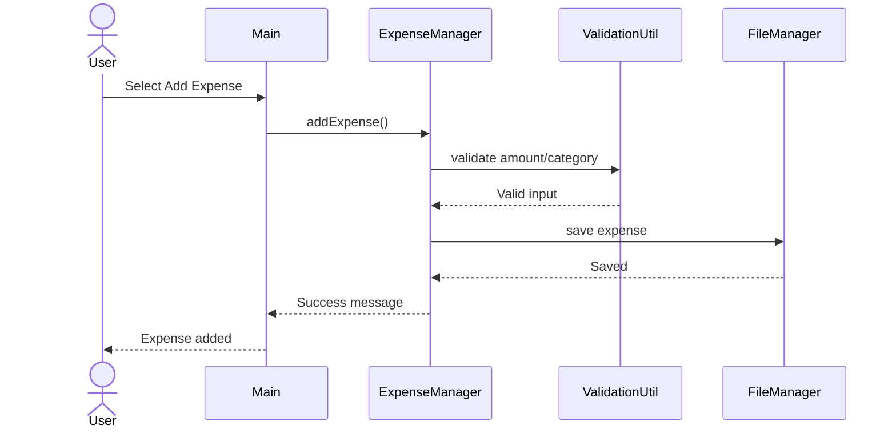

# SmartSpend Diagrams

## 1. Use Case Diagram



## 2. Class Diagram



## 3. Sequence Diagram – Add Expense



## 4. Application Architecture

```text
+---------------------------+
|       CLI / Main          |
+-------------+-------------+
              |
              v
+---------------------------+
|       Service Layer       |
| User | Expense | Income   |
| Budget | Report Managers  |
+-------------+-------------+
              |
              v
+---------------------------+
|       Model Layer         |
| User | Expense | Income   |
| Transaction | Budget      |
+-------------+-------------+
              |
              v
+---------------------------+
|       Utility Layer       |
| FileManager | Validation  |
+-------------+-------------+
              |
              v
+---------------------------+
|      Text File Storage    |
+---------------------------+
```
